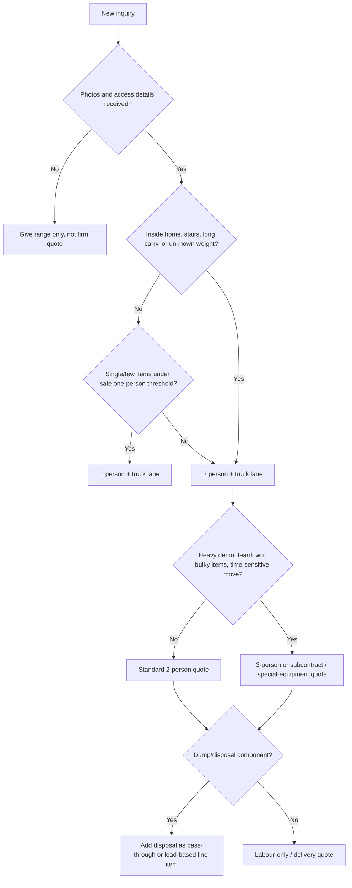

# Bay Delivery Operating Cost and Pricing Research

Archive note: This research document was imported from a ChatGPT research session and normalized for repository use. Source links have been converted to standard Markdown where available. Any unresolved items are labelled for verification.

## Executive summary

This report evaluates Bay Delivery’s likely operating economics in North Bay, Ontario, and Canada, using the uploaded brief as scope only, not as evidence.

The clearest high-confidence finding is that a helper wage of **$16/hour is not legally workable for an employee in Ontario today**. Ontario’s general minimum wage is **$17.60/hour** from October 1, 2025 through September 30, 2026, and is scheduled to rise to **$17.95/hour** on October 1, 2026. Ontario mover, delivery-driver, and material-handler wage benchmarks also sit around **$20.00–$21.50/hour median**, while construction-labour benchmarks are materially higher. In plain English: a $16 helper rate is below the legal floor, and a $20 owner/operator internal labour anchor is possible as a bookkeeping placeholder, but it is light versus current market wages if treated as a true labour cost.

The second big finding is that **Bay Delivery should not rely on a $40 minimum travel charge as a universal rule**. It may survive for a very short, one-person, curbside pickup inside core North Bay, but it is too low for most two-person interior work once travel time, truck cost, idling, non-billable quoting/admin, and utilization losses are included. A more defensible structure is a **zone-based mobilization charge** paired with distinct crew-rate floors. In a realistic small-operator model, the economic floor is roughly **$80–$90/hour for one-person + truck**, **$125–$145/hour for two-person + truck**, and **$170–$190/hour for three-person + truck** before risk surcharges; customer-facing rates should sit above those floors. Comparable Ontario published market pricing commonly lands around **$155–$200/hour for two-person labour-only in North Bay on a platform listing**, **$150–$220/hour for two movers plus truck in Ontario mover rate cards**, and transparent Ontario junk-removal pricing frequently starts around **$79–$125 minimum pickup** and **$179–$349+ for quarter-to-half load jobs**.

On regulation and overhead, the biggest practical points are these. A sole proprietorship or general partnership registration in Ontario is **$60** if Bay is not trading only under the owner’s legal personal name. HST registration is generally not mandatory until taxable revenues exceed **$30,000**, but voluntary registration is allowed. For demolition and certain construction activities, WSIB obligations can become mandatory even for owner-operators unless a narrow home-renovation exemption applies. In City of North Bay, demolition permit materials currently show a **$109 permit fee**, **proof of at least $2 million contractor liability insurance**, and a **consent to guarantee tipping fees**.

For dump-run economics, local disposal pricing matters enough that it should almost never be buried inside a vague hourly quote. The newer North Bay disposal matrix should be treated as the detailed disposal reference for future calibration work: current residential flat-fee anchors are **$10** for six bags or less, **$25** for seven or more bags / a half-ton truck or trailer, and **$35** for a residential double load / vehicle plus trailer. Special-item anchors include **$30 each** for mattresses, box springs, and foam tops, and **$25 each** for refrigerant appliances. Weighed dual-axle and ICI/commercial rates have public-source conflicts, so they should remain manual-confirmation areas before automation. Mixed loads can trigger higher or doubled charges and should be flagged for manual review. That makes “all-in disposal included” a margin trap on heavy mixed loads. Bay Delivery should treat disposal as **actual dump cost plus a handling/admin margin**, or use a tightly controlled load-based matrix. Source conflicts must be verified before production pricing logic relies on them.

The practical bottom line is straightforward: **Bay Delivery should price like a service business, not like a truck with a heartbeat**. The safest immediate structure is a quoted system built around: a local mobilization charge, minimum billable time, clear crew-rate tiers, disposal pass-through, heavy-material surcharges, and a profitability screen that rejects low-contribution jobs unless there is a strategic reason to take them.

## Methods

I treated the uploaded file as a task brief defining scope, priorities, and decision questions, not as the object of verification.

I prioritized authoritative or primary sources wherever they were available: Government of Ontario pages for business registration, employment standards, and consumer rules; Canada Revenue Agency and other Government of Canada sources for HST, payroll, and kilometre benchmarks; WSIB for mandatory-coverage rules and premium-rate context; the City of North Bay for permits, demolition requirements, and Merrick landfill fees; and official manufacturer specification/towing documents for the Ram truck platform where possible. Where exact local Bay Delivery inputs were not available, I used conservative modelling assumptions and clearly label them as assumptions rather than verified facts.

I also used market comparables when official/local price data was sparse. That was especially necessary for customer-facing labour pricing and junk-removal benchmarks, because local direct rate cards in North Bay are limited. In those areas, I favored published Ontario mover and junk-removal pages and North Bay platform listings over generic third-party “average cost” blogs. Confidence is therefore highest on laws, fees, and payroll rules; medium on customer-facing pricing bands; and medium-to-low on exact business-insurance premiums without Bay Delivery’s loss history, drivers, VINs, or annual mileage.

## Findings

### Regulatory and overhead findings

| Topic | What the evidence says | Implication for Bay Delivery |
|---|---|---|
| Ontario business registration | Sole proprietorship or general partnership registration is **$60** in the Ontario Business Registry. If a sole proprietor uses only their own legal name, registration may not be required; if the business has employees, facilities, or offices in Ontario, provincial registration is required. | Bay should budget at least the registration cost and keep entity records updated. |
| HST | HST in Ontario is **13%**. Mandatory registration generally begins once taxable revenues exceed **$30,000** in one quarter or over four consecutive quarters; voluntary registration is allowed earlier. | If Bay is near or above the threshold, quotes should assume HST. Voluntary registration can help recover input tax credits on fuel, dump fees, truck parts, and supplies. |
| WSIB and demolition/construction work | In Ontario construction, owner-operators and sole proprietors often require WSIB coverage unless they fit a narrow exemption, especially the homeowner-direct home-renovation exemption. One non-exempt commercial or subcontracted construction job can trigger coverage requirements. | Bay cannot casually assume “self-employed means exempt” if it performs demolition, structural tear-out, or subcontracted renovation-related work. |
| WSIB premium context | The 2026 average WSIB premium rate is **$1.23 per $100 payroll**, but actual class rates vary widely. Relevant class-rate examples include **F1 truck transportation/postal: $3.41**, **F2 courier/warehousing: $1.43**, **G1 residential building construction: $2.18**, and **G5 specialty trades construction: $2.15**. | Bay should model WSIB as a real labour burden, not a rounding error. Exact classification needs confirmation because the business spans moving, hauling, junk, and demolition. |
| North Bay demolition permit requirements | North Bay’s current demolition checklist shows a **$109 permit fee**, requires **proof of at least $2 million contractor liability insurance**, and includes a **consent to guarantee tipping fees**; the City also states that demolishing a building over **10 m²** requires a permit. | Bay should not quote structural or building demolition casually; permit-sensitive jobs need a permit/insurance checklist before pricing is finalized. |
| Cargo / goods liability rules | Ontario’s Carriage of Goods regulation requires carriers transporting goods for compensation to carry insurance for loss or damage to goods, but the regulation excludes some categories and specifically exempts cargo-insurance requirements for **miscellaneous waste or scrap** and certain indestructible/non-flammable materials. The regulation also excludes goods carried solely within a local municipality. | For moving customer property, Bay should assume higher documentation and contract discipline. For pure scrap/waste runs, rules differ. Local-only North Bay moves should not be assumed to follow the same standard valuation regime without legal review. |
| Movers are not provincially licensed | Ontario explicitly says moving companies are **not licensed by the province**. | Bay’s trust signals need to come from insurance proof, written terms, clear pricing, and reviews rather than a licence claim. |
| North Bay municipal business licensing | North Bay has a business-licensing by-law and a public permit/licence catalogue. The catalogue clearly shows licences for some business classes, including **door-to-door sales/service persons**, but I did **not** find a plainly listed “junk removal” or “moving company” licence category in the public forms index. | Bay should confirm directly with the City whether its exact operating mix requires a municipal business licence, especially if it uses door-to-door solicitation or oversized vehicles. |

### Labour and market-rate findings

| Topic | Verified evidence | What it means |
|---|---|---|
| Ontario minimum wage | General minimum wage is **$17.60/hour** through September 30, 2026 and rises to **$17.95/hour** on October 1, 2026. | A helper rate of **$16/hour** is below the legal employee minimum. |
| Mover wage benchmark | Ontario household-goods mover wages show **$17.60 low / $21.50 median / $29.96 high**. | A $20 operator anchor is below the mover median but not crazy as a bare internal placeholder; it is too thin as a fully loaded labour-cost assumption. |
| Delivery-driver wage benchmark | Ontario delivery-driver wages show **$17.60 low / $20.00 median / $30.00 high**. | Bay’s non-specialized delivery labour is currently closer to a $20/hour market midpoint than to $16/hour. |
| Material-handler benchmark near North Bay | In the Northeast Region around North Bay, material-handler wages show **$17.60 low / $20.00 median / $28.75 high**. | For general loading, carrying, and junk-removal labour, a real market wage is around the $20/hour mark, not $16/hour. |
| Construction/demolition labour benchmark | Ontario general construction labourer benchmarks show **$18.50 low / $27.00 median / $42.00 high**. | Demolition-heavy work should be priced above simple moving/delivery work, both for wages and for customer billing. |
| North Bay labour-only published rate | A North Bay moving-help platform listing shows **$155/hour** for a 2-person crew, and another regional listing shows **$200/hour** for a 2-person crew. | Customer-facing two-person labour rates materially above $120/hour are already normal in the local market context. |
| Ontario mover rate cards | Published Ontario mover rate cards show roughly **$140–$160/hour** for smaller 2-mover jobs and **$200–$220/hour** for larger 2–3 mover/truck jobs, with extra movers often **$60–$75/hour**. | Bay has room to price above bare break-even and still sit inside published Ontario market norms. |
| Ontario junk-removal transparent pricing | Published Ontario junk-removal pages commonly show **$79–$125** minimum pickups, **$179–$299** quarter-load jobs, **$249–$449** half-load jobs, and **$449–$650** full-load-style pricing, depending on truck size and service model. | Bay should stop thinking only in hourly terms for junk runs; load/weight/disposal structure is the stronger quoting frame. |

### Operating-cost findings

| Cost area | Verified evidence | Bay Delivery implication |
|---|---|---|
| Fuel-price backdrop | A national gas-price tracker showed **189.6¢/L** average on May 7, 2026; Ontario’s provincial motor-fuel page was live but its current data feed was temporarily unavailable at the time reviewed. | Bay should model fuel conservatively, not optimistically. A planning assumption around **$1.80–$1.90/L** is safer than pretending 2025 prices still exist. |
| Business kilometre benchmark | CRA travel rates for Ontario were **62.5¢/km** effective April 1, 2026; Finance Canada’s 2026 automobile deduction news release also set a tax-exempt allowance ceiling of **73¢/km for the first 5,000 km, 67¢ after**. | The true all-in cost of using a work vehicle is nowhere near “just gas.” For heavy-service pickups, Bay should model above the CRA travel benchmark, not below it. |
| Ram 1500 capability | Official Ram documents for the 2015 and 2019 Classic 5.7L HEMI platforms show strong towing ranges that depend heavily on configuration and axle ratio, with 2019 Classic examples spanning roughly **8,040–10,710 lb**, and payloads often around **1,500–1,800 lb** depending on trim/configuration. | Bay can physically do a lot with these trucks, but capability on paper is not the same thing as profitable towing. Loaded trailer work needs a higher billing basis than ordinary local delivery. |
| Merrick landfill fee structure | Current North Bay disposal anchors for calibration are **$10** for six bags or less, **$25** for seven or more bags / half-ton truck or trailer, **$35** for residential double load / vehicle plus trailer, **$30 each** for mattresses, box springs, and foam tops, and **$25 each** for refrigerant appliances. Weighed dual-axle and ICI/commercial rates have public-source conflicts, and mixed loads can trigger higher or doubled charges. | Disposal must be a separate priced component. Heavy junk loads can wipe out margin if Bay quotes them like simple labour jobs. Use the North Bay disposal cost and risk matrix as the detailed reference, and verify source conflicts before converting any disputed rate into production pricing logic. |

One quiet but important labour-cost point: statutory payroll burden is meaningful even before “real” benefits are added. Vacation pay is at least **4%** for employees under five years of service; the 2026 EI rate is **1.63% employee / 2.28% employer**; and CPP base contributions are **5.95% employer and employee** on pensionable earnings up to the 2026 limit. That means an employee paid at or near minimum wage is not a $17.60/hour labour cost to the business in any honest model.

## Verification results

### Key claims and verdicts

| Claim / decision question | Verdict | Confidence | Evidence |
|---|---|---|---|
| “A helper at $16/hour works as an employee pay rate.” | **False** | **High** | Ontario minimum wage is $17.60/hour until September 30, 2026. |
| “A $40 travel minimum is a safe default for Bay’s jobs.” | **Usually false** | **Medium-high** | Local two-person market pricing is far above that once crew time and mobilization are considered; published North Bay and Ontario rates imply a higher floor. |
| “Moving, junk, and demo work can all be quoted with the same labour logic.” | **False** | **High** | Wage benchmarks, permit triggers, disposal fees, and WSIB obligations vary materially by work type. |
| “Demolition should be treated as a premium service lane, not generic labour.” | **True** | **High** | North Bay demolition permit rules, liability-insurance requirements, and construction wage/WSIB exposure all support premium treatment. |
| “Dump fees should be passed through separately or tightly controlled.” | **True** | **High** | Merrick’s fee structure uses residential flat tiers, item-specific charges, weighed/manual-confirmation paths, and mixed-load penalties, which creates margin volatility on disposal-heavy jobs. |
| “Customer-facing rates materially above $120/hour for a two-person crew are market-realistic.” | **True** | **Medium-high** | North Bay labour-only listings and Ontario mover rate cards support higher two-person rates. |
| “Bay should use photo-based triage and crew rules before giving firm quotes.” | **True** | **Medium** | This is a business-process recommendation, but it is strongly supported by how pricing varies with stairs, access, load size, demolition scope, and disposal weight in comparable service pages and local permit requirements. |

### Modelled break-even economics

The table below is a **model**, not a government or market quote. It uses conservative assumptions that are grounded in the verified evidence above:

- owner/operator effective labour target: **$25–$28/hour**
- helper fully loaded cost: **about $21–$24/hour** once minimum wage, vacation, EI, CPP, public-holiday exposure, and a moderate WSIB class are recognized
- truck operating reserve: **about $12/hour** in local service, which is consistent with severe-duty use sitting above the Ontario 62.5¢/km CRA business-travel benchmark once idle time and low local-speed utilization are considered
- admin / overhead reserve: **12% of revenue**
- operating-profit target: **15% of revenue**
- billable utilization: **65%** rather than fantasy-level 100% utilization.

| Service configuration | Direct hourly cost to Bay | Modelled floor at 65% utilization, 12% overhead, 15% operating profit | Recommended public-facing rate band |
|---|---:|---:|---:|
| 1 person + truck | about **$37–$40/hr** | about **$80–$90/hr** | **$95–$115/hr** |
| 2 people + truck | about **$59–$64/hr** | about **$125–$145/hr** | **$165–$195/hr** |
| 3 people + truck | about **$81–$88/hr** | about **$170–$190/hr** | **$220–$250/hr** |
| Extra helper added to existing truck job | about **$21–$24/hr** direct | about **$45–$50/hr** floor | **+$55–$70/hr** |

Those recommendations are intentionally not bargain-bin numbers. They leave room for the stuff that always shows up in the real world: deadhead time, schedule gaps, dump-line waiting, jobs that take longer than photos suggested, slow-paying customers, rework, and the occasional “that couch looked smaller on Facebook Marketplace” disaster. The rate bands also line up much better with published Ontario moving and junk-removal pricing than Bay’s original internal anchors do.

### Travel-charge conclusion

A flat **$40 mobilization/travel minimum** is only defensible for a very short, low-risk, one-person job in the core city. For Bay’s standard interior pickups, mixed junk runs, moving assistance, or any job that dispatches two people, a healthier rule is:

- **$55–$65** local mobilization for one-person jobs
- **$75–$95** local mobilization for two-person jobs
- out-of-zone pricing beyond the core city either as a km charge or as fixed travel blocks.

That recommendation follows directly from the break-even model and from the fact that published market pricing in North Bay and Ontario is already living above those contribution thresholds.

## Gaps and limitations

Some critical Bay-specific inputs were not available, so a few cost lines remain modelled rather than verified. I did **not** have Bay’s actual truck VINs, trim/axle combinations, annual kilometres, finance status, insurance quotes, driver records, trailer specs, storage/yard costs, or real monthly utilization. Because of that, I can verify the regulatory floors and market direction with confidence, but not give a pretend-precise “Bay’s exact cost is $X.XX/hour” number without overselling certainty.

The exact WSIB premium Bay will pay is also **not fully resolved** here because Bay’s mix spans multiple possible classes: truck transportation, courier/warehousing-type work, and construction-related activities. I can say with high confidence that WSIB may become mandatory for demolition/construction work and that the class-rate spread is material; I cannot honestly claim a single definitive Bay rate without the exact classification and business-activity breakdown.

Customer-facing competitor pricing in North Bay is also only **partially transparent**. Some local businesses are clearly operating in the market, but few publish detailed rate cards. That forced the customer-rate analysis to lean on a mix of North Bay platform pricing and broader Ontario rate cards. That is good enough to set a rational pricing lane, but not good enough to claim a single “North Bay market average” with statistical precision.

## Recommendations

Bay Delivery should immediately separate its work into **four quoting lanes**: simple delivery, moving labour, junk removal / dump runs, and demolition / tear-out. Those lanes have different wage logic, different regulatory exposure, and different margin traps. A single flat mental model for all four will keep underpricing the hardest jobs.

The best practical pricing structure is:

| Quote element | Recommended rule | Why |
|---|---|---|
| Mobilization | Core-city call-out instead of universal $40 travel fee | Travel time and truck cost must be recovered even on short jobs. |
| Minimum billable time | **1 hour** for tiny curbside/single-item jobs; **2 hours** for interior or two-person jobs; **3–4 hours** for full moving jobs | Published Ontario moving pages commonly use minimums, and minimums protect utilization. |
| Labour tiering | 1-person + truck, 2-person + truck, 3-person + truck, extra helper add-on | Keeps quotes tied to actual labour economics. |
| Disposal | **Actual landfill/disposal cost + handling margin**, or strict load/weight tiers | Merrick fees include flat residential tiers, special-item charges, weighed/manual-confirmation paths, and mixed-load penalties. Heavy or disputed-source loads can create margin blowouts. |
| Demo jobs | Quote separately from junk jobs; require permit/insurance checklist where applicable | North Bay demolition jobs trigger different risk and permit rules. |
| Profit screen | Reject or re-price any job projected below **20% contribution margin** unless it fills a dead slot or creates follow-on revenue | Small service businesses die from “busy but broke.” |

For hiring and crew rules, Bay should use this decision logic:

In people terms, the rule should be: **one person for curbside and low-risk jobs, two people by default for interior and uncertain jobs, three people only when the time saved is worth more than the extra labour cost**. A third person is often cheaper for the customer when it cuts job time by more than one-third, but it is pure margin destruction when added just because “more bodies feels safer.” That is the kind of thing that quietly murders a small operation.

For immediate implementation, I would set Bay’s first-pass public rate card like this:

- **1 person + truck:** **$95–$115/hour**, 1-hour minimum on simple jobs
- **2 people + truck:** **$165–$195/hour**, 2-hour minimum for interior work
- **3 people + truck:** **$220–$250/hour**, only when justified by job speed/safety
- **Extra mover:** **+$55–$70/hour**
- **Local mobilization:** **$55–$65 one-person**, **$75–$95 two-person**
- **Landfill / disposal:** actual cost plus handling margin, with special item surcharges for mattresses, box springs, foam tops, refrigerant appliances, and other confirmed fee-trigger items
- **Demolition / selective tear-out:** quote separately, never at the same hourly logic as simple moving help.

The first admin clean-up I would do behind the scenes is also simple. Bay should decide, in writing, whether helpers are employees or true subcontractors; register/pay correctly for that model; verify HST timing; confirm its WSIB position for demolition/construction activities; document proof of commercial auto, contractor liability, and—where applicable—goods/cargo protection; and standardize a written estimate template that distinguishes **labour**, **travel**, **disposal**, **special handling**, and **tax**. That is not glamorous, but it is where pricing stops leaking.
## Source register and verification notes

### Seeded source anchors

- [City of North Bay — Landfill Operations / Merrick Landfill](https://northbay.ca/services-payments/garbage-recycling/landfill-operations/tipping-fees/)
- [City of North Bay — Waste Diversion](https://northbay.ca/services-payments/garbage-recycling/garbage-recycling/waste-diversion/)
- [City of North Bay — Garbage & Recycling](https://northbay.ca/services-payments/garbage-recycling/garbage-recycling/)
- [City of North Bay — 2026 Collection Calendar PDF](https://northbay.ca/media/yuylovpg/2026-north-bay-collection-calendar.pdf)
- [705 Junk](https://705junk.ca/) and [705 Junk FAQ](https://705junk.ca/faq)
- [Mr. Junk pricing](https://mr-junk.ca/pricing/)
- [ScrapMaster North Bay](https://www.scrapmaster.ca/) and [ScrapMaster appliance recycling](https://www.scrapmaster.ca/appliance-recycling/)
- [Martin Services](https://martinservices.org/)
- [Ontario minimum wage](https://www.ontario.ca/book/export/html/95384)
- [Ontario minimum wage newsroom release](https://news.ontario.ca/en/release/1007239/ontario-raising-minimum-wage-to-protect-workers-and-support-a-competitive-economy)
- [Ontario business registration](https://www.ontario.ca/page/business/start/register-your-business-online)
- [WSIB mandatory construction coverage](https://www.wsib.ca/en/businesses/registration-and-coverage/mandatory-coverage-construction-industry)
- [WSIB optional coverage](https://www.wsib.ca/en/businesses/registration-and-coverage/can-i-choose-have-wsib-insurance)
- [WSIB expanded compulsory construction policy](https://www.wsib.ca/en/operational-policy-manual/expanded-compulsory-coverage-construction)

### Verification-needed source groups

The original research session cited additional web results using chat-runtime source IDs only. Those IDs are not resolvable outside the chat transcript, so they were removed from inline text. Claims supported only by those opaque IDs should be rechecked before they are used for production pricing, customer-facing copy, or implementation work.

Verification-needed groups include Ontario/Canada tax and payroll references, Job Bank wage benchmarks, CRA and Finance Canada kilometre/automobile benchmarks, insurance estimates, Ram truck towing and payload charts, Ontario mover and junk-removal comparables not listed in the seeded anchors, local competitors without seeded URLs, by-law PDFs, demolition checklists, AIM/Circular Materials references, and any document-specific source label marked `[source verification needed]`.
